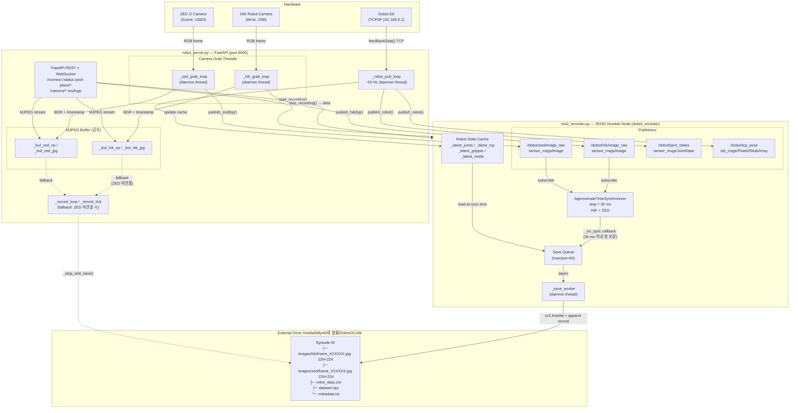
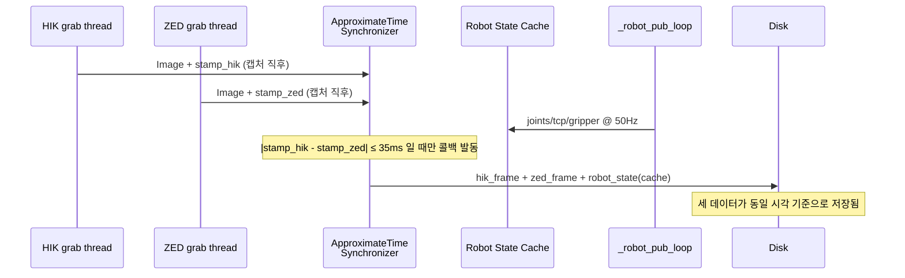

# ROS2 Synchronized Recording — System Flowchart

## 전체 데이터 흐름



---

## 동기화 핵심 원리



---

## 모드별 동작 요약

| 조건 | 레코딩 경로 | 동기화 품질 |
|---|---|---|
| ROS2 설치 + HIK + ZED | `ros2_recorder` sync callback | HIK↔ZED 35ms 이내 보장 |
| ROS2 설치 + HIK only | legacy `_record_tick` fallback | 버퍼 지연 최대 50ms |
| ROS2 미설치 | legacy `_record_tick` fallback | 버퍼 지연 최대 50ms |

---

## 데이터 정합(align) 확인 방법

### 1. 서버 로그 (WebSocket `/ws/logs`)
```
[09:34:11] Recording started → .../1 (ZED=ON, mode=ROS2+sync)
[09:34:45] [ros2_recorder] stopped — 680 synced frames
```
`mode=ROS2+sync` + synced frames 수로 동기화 정상 동작 확인.

### 2. `/status` 엔드포인트 (추후 추가 예정)
```json
{
  "ros2_sync_frames": 680,
  "ros2_sync_hz": 19.8,
  "ros2_mode": "sync"
}
```

### 3. 수집 후 오프라인 검증
```python
import numpy as np
data = np.load("dataset.npy", allow_pickle=True)
timestamps = [d['timestamp'] for d in data]
diffs = [timestamps[i+1] - timestamps[i] for i in range(len(timestamps)-1)]
print(f"평균 간격: {sum(diffs)/len(diffs)*1000:.1f} ms")  # 목표: ~50ms (20Hz)
print(f"최대 간격: {max(diffs)*1000:.1f} ms")              # 이상치 확인
```
