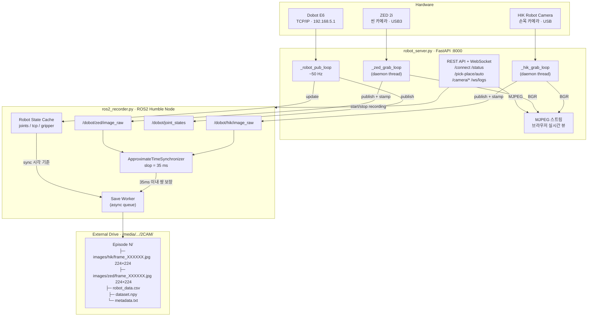
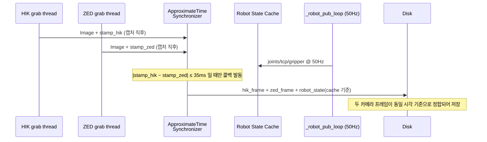

# Dobot-Arm-DataCollect

Dobot E6 로봇 + 듀얼 카메라(HIK + ZED)를 이용한 VLA(Vision-Language-Action) 데이터 수집 시스템.
FastAPI 기반 웹 서버와 ROS2 Humble 동기화 레코더를 통해 로봇 상태와 카메라 프레임을 정밀하게 정합(align)하여 저장한다.

---

## 시스템 구성

| 구성 요소 | 사양 |
|---|---|
| 로봇 | Dobot E6 (TCP/IP 192.168.5.1) |
| 손목 카메라 | HIKRobot (USB) |
| 씬 카메라 | ZED 2i (USB3, LEFT view) |
| 컴퓨터 | NVIDIA Jetson (Ubuntu 22.04 aarch64) |
| 서버 | FastAPI (port 8000) |
| 동기화 | ROS2 Humble — ApproximateTimeSynchronizer |

---

## 데이터 수집 파이프라인



### 동기화 원리



### 모드별 동작

| 조건 | 레코딩 경로 | 동기화 품질 |
|---|---|---|
| ROS2 + HIK + ZED | `ros2_recorder` sync callback | HIK ↔ ZED 35ms 이내 보장 |
| ROS2 + HIK only | legacy `_record_tick` fallback | 버퍼 지연 최대 50ms |
| ROS2 미설치 | legacy `_record_tick` fallback | 버퍼 지연 최대 50ms |

---

## 설치

### 1. 의존 패키지

```bash
pip install fastapi uvicorn numpy opencv-python
```

### 2. ROS2 Humble (Ubuntu 22.04 aarch64)

```bash
sudo apt install -y software-properties-common curl
sudo curl -sSL https://raw.githubusercontent.com/ros/rosdistro/master/ros.key \
     -o /usr/share/keyrings/ros-archive-keyring.gpg
echo "deb [arch=$(dpkg --print-architecture) signed-by=/usr/share/keyrings/ros-archive-keyring.gpg] \
     http://packages.ros.org/ros2/ubuntu jammy main" \
     | sudo tee /etc/apt/sources.list.d/ros2.list
sudo apt update
sudo apt install -y ros-humble-ros-base ros-humble-cv-bridge \
                    python3-rclpy python3-sensor-msgs

echo 'source /opt/ros/humble/setup.bash' >> ~/.bashrc
source ~/.bashrc
```

### 3. 카메라 SDK

- **HIKRobot**: MVS SDK 설치 후 `MvImport/` 경로 확인
- **ZED**: [ZED SDK](https://www.stereolabs.com/developers/) + `pyzed` 설치

---

## 실행

```bash
cd Dobot_E6_Moveit2/src
source /opt/ros/humble/setup.bash
python robot_server.py
```

브라우저에서 `http://<Jetson-IP>:8000` 접속.

### 서버 시작 로그 (정상)

```
[ros2_recorder] ROS2 노드 시작 완료
[HH:MM:SS] ROS2 recorder ready (sync mode)
[HH:MM:SS] Server ready
```

### 데이터 수집 순서

1. **Connect** — 로봇 TCP/IP 연결
2. **Enable** — 로봇 활성화
3. **Camera Start** — HIK / ZED 카메라 시작
4. **Auto Collect N** — N개 에피소드 자동 수집
5. 수집 완료 로그 확인:
   ```
   Recording started → .../1 (ZED=ON, mode=ROS2+sync)
   [ros2_recorder] stopped — 680 synced frames
   Saved 680 frames → .../1
   ```

---

## 저장 데이터 형식

에피소드 하나당 아래 구조로 저장된다.

```
Episode N/
├── images/
│   ├── hik/  frame_000000.jpg ~ frame_XXXXXX.jpg   # 224×224 (손목 카메라)
│   └── zed/  frame_000000.jpg ~ frame_XXXXXX.jpg   # 224×224 (씬 카메라)
├── robot_data.csv    # 프레임별 타임스탬프 + 관절각 + TCP 포즈 + 그리퍼 상태
├── dataset.npy       # robot_data.csv 와 동일 내용 (numpy array of dicts)
└── metadata.txt      # 에피소드 요약 (날짜, 프레임 수, 카메라 구성, 성공 여부)
```

### robot_data.csv 컬럼

| 컬럼 | 설명 |
|---|---|
| `frame_id` | 프레임 번호 (0-indexed) |
| `timestamp` | HIK 캡처 시각 (ROS clock, float) |
| `image_path_hik` | `hik/frame_XXXXXX.jpg` |
| `image_path_zed` | `zed/frame_XXXXXX.jpg` |
| `j1` ~ `j6` | 관절각 (deg) |
| `x y z rx ry rz` | TCP 포즈 (mm / deg) |
| `gripper_tooldo1` | 그리퍼 상태 (0/1) |
| `robot_mode` | 로봇 모드 코드 |

### 수집 후 품질 확인

```python
import numpy as np

data = np.load("dataset.npy", allow_pickle=True)
timestamps = [d['timestamp'] for d in data]
diffs = [timestamps[i+1] - timestamps[i] for i in range(len(timestamps)-1)]
print(f"평균 간격: {sum(diffs)/len(diffs)*1000:.1f} ms")  # 목표: ~50 ms (20 Hz)
print(f"최대 간격: {max(diffs)*1000:.1f} ms")              # 이상치 확인
```

---

## 브랜치 구조

| 브랜치 | 설명 |
|---|---|
| `main` | 기본 TCP/IP 제어 스크립트 |
| `ros2` | FastAPI 서버 + ROS2 동기화 레코더 통합 버전 |

---

## 주요 파일

```
Dobot_E6_Moveit2/src/
├── robot_server.py          # FastAPI 메인 서버 (카메라·로봇·레코딩 통합)
├── ros2_recorder.py         # ROS2 동기화 레코더 모듈
├── dobot_e6_controller.py   # Dobot E6 TCP/IP 제어
├── pick_place_gui_random_pose.py  # 랜덤 포즈 Pick-Place 워커
├── camera_viewer.py         # HIKRobot 카메라 래퍼
├── suction_gripper.py       # 흡착 그리퍼 제어
└── ROS2_FLOWCHART.md        # 상세 시스템 플로우차트
```
